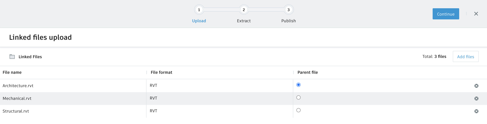
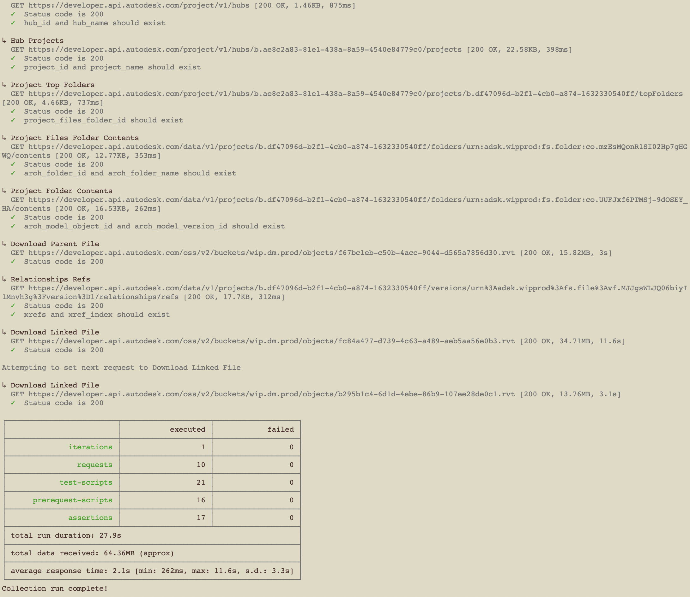
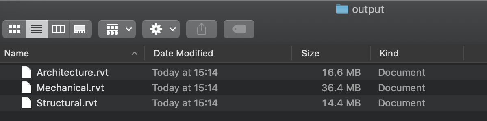

# Download Linked Files

This method only works when the Revit host model and linked files are uploaded using the **Upload as linked files** command in BIM360 Docs.

## Upload Linked Files BIM360 Docs Dialog



In this scenario, the **Architecture.rvt** file is the parent model. The **Mechanical.rvt** and **Structural.rvt** models are the linked files.

## Steps to run the download of Revit Linked Files

1. Open in your favorite text editor [assets/environment/download_linked_files.postman_environment.json](../assets/environment/download_linked_files.postman_environment.json) and edit the environment variables' values

    ```arch_file_name=Architecture.rvt``` \
    ```arch_folder_name=<your Docs folder>``` \
    ```client_id=<your Forge app client ID>``` \
    ```client_secret=<your Forge app client secret>``` \
    ```hub_name=<your BIM360 hub name>``` \
    ```project_name=<your BIM360 project name>``` \
    ```scope=data:read``` \
    ```x-user-id=<your user ID>```

1. Open a terminal and change directory to the repository

1. Run the command `npm test`

1. Input **4** for executing the **Download Linked Files (Newman)** test run



1. Check output directory for new downloaded files


