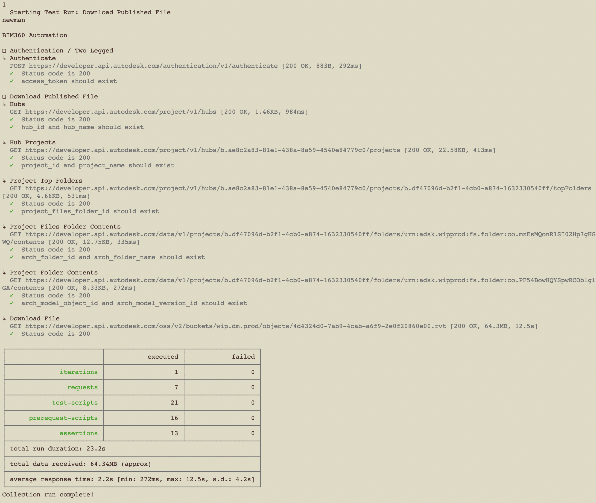

# Download Published File

In this scenario, the Revit linked files were setup in Revit desktop and published to BIM360 Docs.

## Typical users' workflow


## Revit Manage Links Dialog


## Revit Publish to Docs Dialog


## Steps to run the download of a single Revit file:

1. Open in your favorite text editor [assets/environment/download_published_file.postman_environment.json](../assets/environment/download_published_file.postman_environment.json) and edit the environment variables' values

    ```arch_file_name=<your Revit model file name>``` \
    ```arch_folder_name=<your BIM360 folder name>``` \
    ```base_url=https://developer.api.autodesk.com``` \
    ```client_id=<your Forge app client ID>``` \
    ```client_secret=<your Forge app client secret>``` \
    ```hub_name=<your BIM360 hub name>``` \
    ```project_name=<your BIM360 project name>``` \
    ```scope=data:read``` \
    ```x-user-id=<your user ID>``` \

1. Open a terminal and change directory to the repository

1. Run the command `npm test`

1. Input **1** for executing the **Download Published File (Newman)** test run



1. Check output directory for new downloaded Revit model


