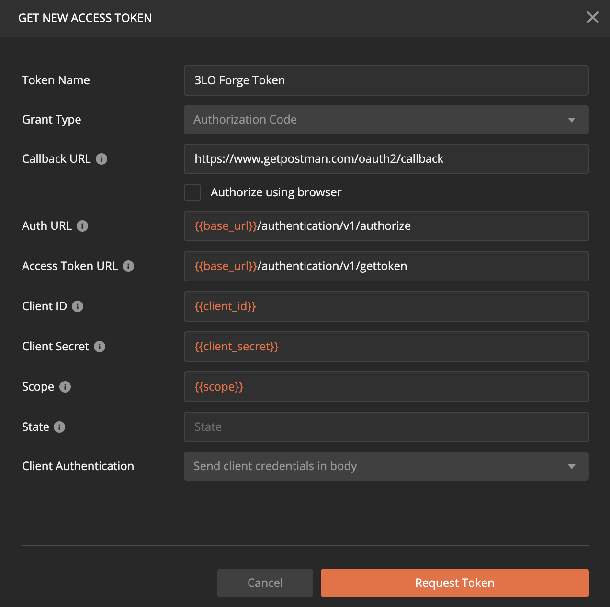

# Setting User Context

Throughout the documented test runs, you will find that we pass a special header to each request. The header is called **x-user-id** and allows to set user context when making API calls to the BIM360 Docs platform.

In a two-legged authentication context, the app has access to all users specified by the administrator in the SaaS integrations UI. By providing this header, the API call will be limited to act on behalf of only the user specified.

## Retrieving the X-User-Id header value

1. Launch Postman and expand Authentication > Three Legged folder

1. Select an environment that has your Forge app keys

1. Open **GET Profile** endpoint and open the **Authorization** tab

1. Click on **Get New Access Token** button

1. Specify the values as shown in below screenshot (please enter the Callback URL you registered for your Forge app as Postman will intercept the call)

1. Click on **Request Token** button

1. Login with your user credentials and grant access to the Forge app

1. Click on **Use Token** button

1. Hit **Send** to send the request

1. In the response body, copy the **userId** value

This value will have to be pasted into the various environment JSON files under **x_user_id** attribute.
