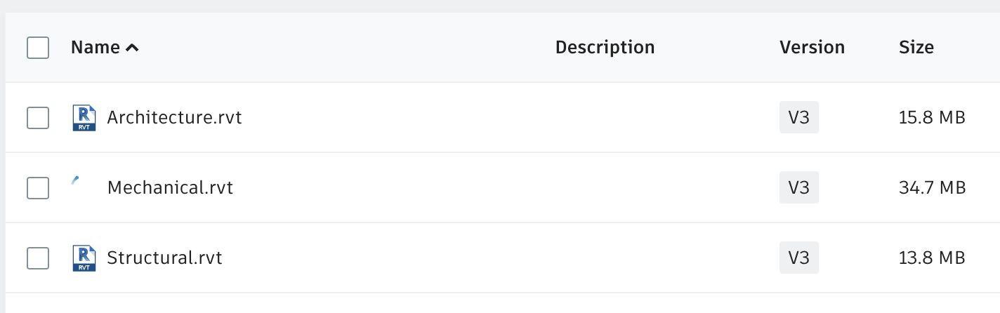

# Upload New Versions of Linked Files

In this scenario, we are automating the upload of new versions of Revit files to a BIM360 Docs folder.

## Steps to run the upload of new file versions

1. Open in your favorite text editor [assets/environment/overwrite_linked_files.postman_environment.json](../assets/environment/overwrite_linked_files.postman_environment.json) and edit the environment variables' values

    ```client_id=<your Forge app client ID>``` \
    ```client_secret=<your Forge app client secret>``` \
    ```hub_name=<your BIM360 hub name>``` \
    ```project_name=<your BIM360 project name>``` \
    ```upload_folder_name=<your BIM360 folder name>``` \
    ```upload_file_name=<your BIM360 folder name>``` \
    ```scope=data:read data:create data:write``` \
    ```x-user-id=<your user ID>``` \

1. Open a terminal and change directory to the repository

1. Run the command `npm test`

1. Input **6** for executing the **Overwrite Linked Files (Newman)** test run


1. Check BIM360 Docs folder for new uploaded models' versions


