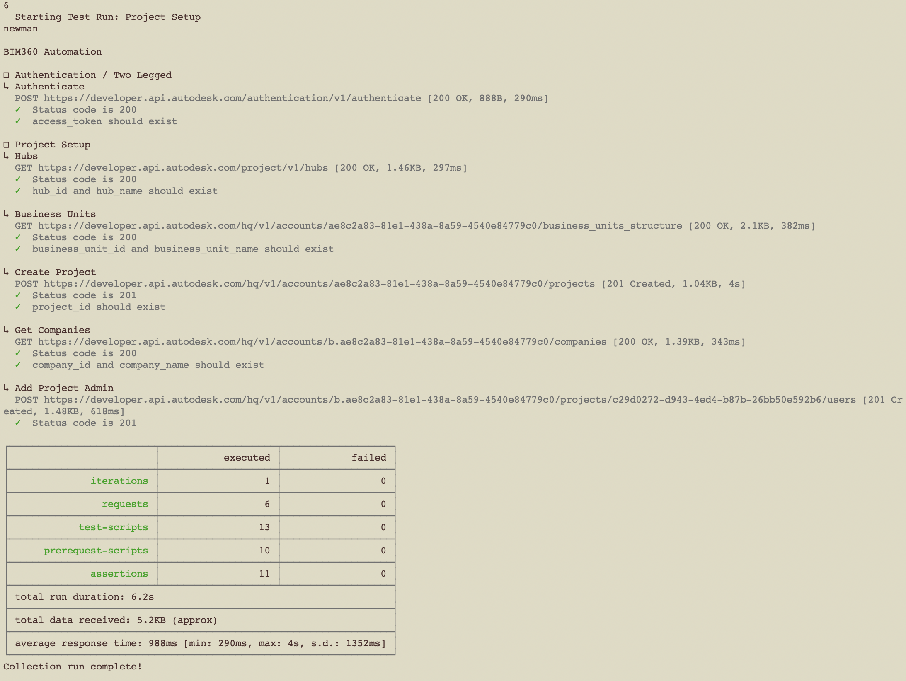
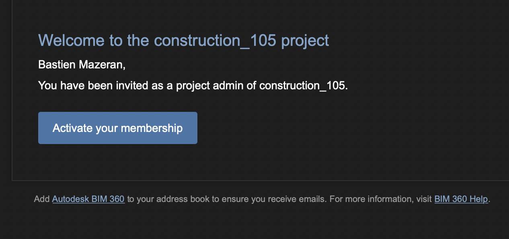

# Project Setup Automation

In this scenario, we are trying to automate the creation of new BIM360 Docs project using the Forge APIs.

## Steps to create a new project in BIM360

1. Open in your favorite text editor [assets/environment/project_setup.postman_environment.json](../assets/environment/project_setup.postman_environment.json) and edit the environment variables' values

    ```business_unit_name=<your BIM360 business unit>``` \
    ```base_url=https://developer.api.autodesk.com``` \
    ```client_id=<your Forge app client ID>``` \
    ```client_secret=<your Forge app client secret>``` \
    ```construction_type=<your new project construction type>``` \
    ```contract_type=<your new project contract type>``` \
    ```currency=<your new project currency>``` \
    ```hub_name=<your BIM360 hub name>``` \
    ```project_name=<your new project name>``` \
    ```project_type=<your new project type>``` \
    ```service_type=<your new project service type>``` \
    ```scope=data:read account:read account:write``` \
    ```timezone=<your new project timezone>``` \
    ```x-user-id=<your user ID>``` \

   If unsure what values to input, please refer to the [parameters](https://forge.autodesk.com/en/docs/bim360/v1/overview/parameters/) documentation page.

1. Open a terminal and change directory to the repository

1. Run the command `npm test`

1. Input **6** for executing the **Project Setup** test run



1. Go to your inbox and look for new project welcome email


